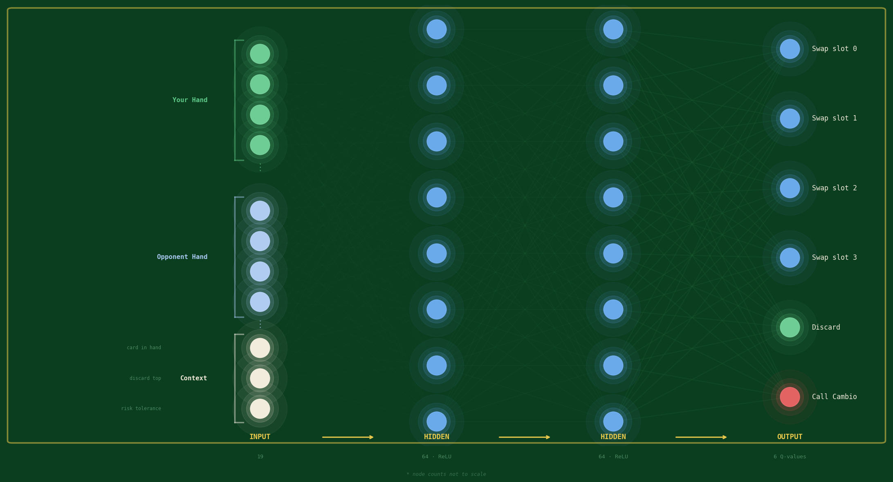

# Cambio AI — Neural Network from Scratch



A personal project to understand how neural networks actually work — not by calling `model.fit()`, but by building everything by hand: forward passes, backpropagation, gradient descent, and a full Q-learning loop. The game engine was also written from scratch as the training environment.

> The Pygame front end was entirely AI-assisted — that was intentional. The point of this project was the ML implementation, not the GUI. It's there so you can play the game and see the agents in action.

---

## What I built

### Cambio Game Engine (`cambio.py`, `player.py`)

A full implementation of the Cambio card game from scratch — no game libraries:

- Full deck (52 cards + 2 jokers), shuffling, dealing and game set up
- Per-player partial knowledge tracking (you only know the cards you've peeked)
- All five power cards with correct game logic
- Dynamic risk tolerance calculated from known card scores
- Cambio call mechanic — opponent gets one final turn, then scores are revealed

### Neural Network (`network.py`, `layer.py`)

Built from scratch in NumPy — no PyTorch, no TensorFlow:

- `Layer` class: matrix multiply forward pass, manual backpropagation with the chain rule
- ReLU activation, MSE loss
- He weight initialisation, zero-bias initialisation
- Gradient clipping to prevent exploding gradients
- `Network` class supporting arbitrary depth — e.g. `[19, 64, 64, 6]`
- ReLU only on hidden layers, raw output on the final layer

### Q-Learning Agent (`agent.py`)

- Epsilon-greedy action selection (starts fully exploratory, decays over training)
- Experience replay buffer (`deque`, capacity 10,000)
- Bellman target: `Q(s,a) = r + γ · max Q(s')`
- 19-value game state encoding built from partial information
- Dense step rewards + terminal win/loss signal
- Weight save/load with `np.save` / `np.load`

---

## The Game

Cambio is a memory and strategy card game. The goal is to have the lowest total hand score when someone calls "Cambio." You only know some of your own cards — and almost none of your opponent's — so you have to reason under uncertainty.

### Card Values

| Card | Value |
|------|-------|
| Ace | 1 |
| 2–9 | Face value |
| 10, J, Q, K | 10 |
| Red Kings (K♥, K♦) | -1 |
| Joker | 0 |

### Power Cards

| Card | Power |
|------|-------|
| 7, 8 | Peek one of your own unknown cards |
| 9, 10 | Peek one of your opponent's unknown cards |
| Jack | Blind swap — exchange one of your cards with opponent's |
| Queen | Peek opponent's card, then swap |
| King | Peek own + opponent card, then swap |

---

## AI Agents

Three opponents to play or train against:

| Agent | Description |
|-------|-------------|
| **Random** | Picks actions uniformly at random — the baseline |
| **Heuristic** | Rule-based: swaps unknown cards if drawn card is below risk tolerance, prioritises offloading high-scoring known cards |
| **Q-Learning** | Trained neural net — 19 inputs, two hidden layers of 64, 6 Q-value outputs |

### Training Results

After 5,000 episodes against the heuristic opponent:

- Q-learning agent win rate: **~41%**
- Random baseline win rate: **~17%**

The heuristic opponent plays with the same partial information as a real game (2 cards revealed at start). The gap over random represents genuine learning under uncertainty — though there's plenty of room to improve with more training and a better reward signal.

---

## Neural Network Architecture

```
Input (19)  →  Hidden (64, ReLU)  →  Hidden (64, ReLU)  →  Output (6)
```

**Input vector (19 values):**

| Values | Description |
|--------|-------------|
| 8 | Own cards: score + known flag × 4 |
| 8 | Opponent cards: score + known flag × 4 |
| 1 | Card currently in hand |
| 1 | Top of discard pile |
| 1 | Risk tolerance |

Unknown cards are encoded as `0.0` with `known = 0.0` so the network can distinguish "unknown" from a zero-scoring card.

**Output — 6 Q-values (0-5):**

| Action | Meaning |
|--------|---------|
| 0–3 | Swap drawn card with inventory slot 0–3 |
| 4 | Discard drawn card |
| 5 | Call Cambio |

---

## Project Structure

```
cambio.py       — Game engine and rules
player.py       — Player class with partial knowledge tracking
network.py      — Neural network (forward, backward, ReLU, MSE)
layer.py        — Layer class with He init and gradient clipping
agent.py        — Q-learning agent and experience replay buffer
train.py        — Training loop with win rate tracking
baseline.py     — Random agent baseline
pygame_game.py  — Pygame front end (AI-assisted)
model_w*.npy    — Saved network weights
model_b*.npy    — Saved network biases
```

---

## Setup

```bash
git clone https://github.com/SamanAshoori/cambio-ai
cd cambio-ai
python -m venv .venv
source .venv/bin/activate      # Windows: .venv\Scripts\activate
pip install numpy pygame
```

## Usage

**Play the game:**
```bash
python pygame_game.py
```
Pick your opponent (Random, Heuristic, or Neural Net) from the menu. On your turn, draw a card then choose to swap it into one of your slots or discard it. Call Cambio when you think your score is low enough to win.

**Train the agent:**
```bash
python train.py
```
Trains for 5,000 episodes by default, prints win rate every 100. Saves weights to `model_w*.npy` on completion. Increase `episodes` in `train.py` to train longer.

**Run the random baseline:**
```bash
python baseline.py
```

---

## Resources

- [Cambio rules](https://cambiocardgame.com/)
- [Neural network fundamentals (3Blue1Brown)](https://www.youtube.com/watch?v=75FnxGTQB7g)
